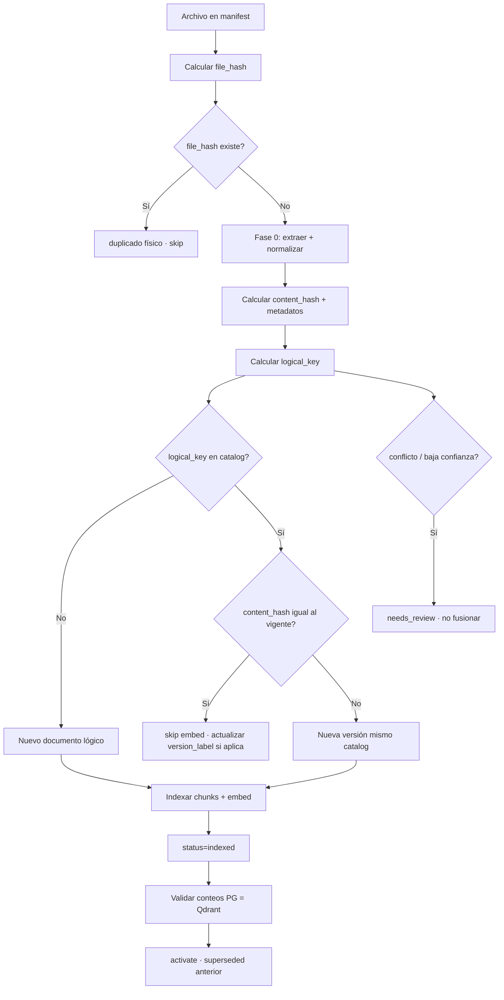

# Identidad documental — archivo, documento lógico y versión

**Fecha:** 2026-08-31  
**Bloque plan:** B1 (detección de versiones) · complementa `002_ingestion_v2.sql`  
**Estado código:** B1 completo — pipeline + CLI dry-run + dashboard logical_key / needs_review

---

## 1. Problema que resuelve

En ODS1 conviven tres confusiones frecuentes:

| Confusión | Ejemplo | Consecuencia sin reglas |
|-----------|---------|-------------------------|
| Mismo archivo en rutas distintas | Minuta + sobre de envío | Re-indexar y duplicar chunks |
| Misma guía, revisión nueva | GUIGS Rev 4 → Rev 6 | Mezclar versiones o perder la vigente |
| Mismo nombre, documento distinto | Dos `Manual.pdf` de equipos diferentes | Fusionar procedimientos incorrectamente |

**Principio:** no confundir **archivo**, **documento lógico** y **versión**.

---

## 2. Tres identificadores (nomenclatura MMI)

Alineado con schema v2 y código actual:

| Concepto | Campo MMI | Qué identifica | Cuándo se calcula |
|----------|-----------|----------------|-------------------|
| **Huella física** | `file_hash` | Bytes exactos del archivo (SHA-256) | Antes de extraer |
| **Huella semántica** | `content_hash` | Texto extraído normalizado (SHA-256) | Tras Fase 0 / chunking |
| **Documento lógico** | `logical_key` → `document_key` | Identidad de negocio del documento | Tras extraer metadatos |
| **Versión** | `version_id` → fila `documents` + `version_label` | Una entrega concreta del documento lógico | Al registrar ingesta |

> **Nota:** en conversación informal a veces se dice “content_hash del archivo”; en MMI **`file_hash`** es el binario y **`content_hash`** es el texto. Mantener esta distinción evita bugs.

### Tablas

```
document_catalog (1 por logical_key / tenant)
    └── documents (N versiones: file_hash, content_hash, version_label, status)
            └── chunks → Qdrant
```

Estados de versión ya definidos: `received` → `processing` → `indexed` → `active` | `failed` | `superseded`.

---

## 3. Reglas de decisión

### R1 — Mismo archivo (duplicado físico)

**Condición:** `file_hash` ya existe en `documents` para el tenant.

**Acción:** `estado = duplicado` · no extraer de nuevo · no embeddear · registrar job `skipped`.

**Implementado hoy:** ✅ `pipeline.py` → `pg_find_document(tenant_id, file_hash)`.

---

### R2 — Misma guía, texto cambiado (nueva revisión)

**Condición:** `file_hash` nuevo **y** `logical_key` ya existe en `document_catalog` **y** `content_hash` distinto al vigente.

**Acción:**

1. Insertar nueva fila `documents` (`status=processing`).
2. Indexar chunks + Qdrant (`is_current=false`, `version_status=indexed`).
3. Tras validación → `pg_activate_document_version`: activar nueva, marcar anterior `superseded` en PG + Qdrant.

**Implementado hoy:** ⚠️ activación atómica ✅ · detección previa por `content_hash` ❌ (B1 pendiente).

---

### R3 — Mismo nombre de archivo, contenido distinto

**Condición:** `Path.name` igual o similar, pero identidad lógica distinta.

**Regla:** el **nombre de archivo no es identidad**. Construir `logical_key` con metadatos en este orden de prioridad:

1. `tenant_id`
2. `origen` / fuente (ODS1, lote, SharePoint, OEM…)
3. `asset_tag` o equipo asociado (`catalog_assets`)
4. `tipo_documental` (guía, norma, sop, manual_oem, tabla…)
5. `modulo` / área (M&C, DCH, eléctrico…)
6. `codigo_documento` (SGP-07MYC-GUIGS-00001, NCC-030…)
7. `numero_guia` / procedimiento
8. `titulo_normalizado` (sin rev, sin extensión, lower, sin acentos)
9. `proveedor` / fabricante (Siemens, Schneider…)

**Si `logical_key` coincide** → R2 (nueva versión).  
**Si no coincide** → nuevo `document_catalog` aunque el filename sea idéntico.

**Implementado hoy:** ⚠️ `derive_document_key()` solo usa regex sobre nombre; metadatos enriquecidos pendientes (B4).

---

### R4 — Identidad incierta

**Condición:** coincidencia parcial (ej. mismo código pero distinto activo; título ambiguo; OCR baja confianza).

**Acción:** `needs_review` en ingesta · no fusionar · no activar automáticamente.

**Manifest / dashboard:** calidad `review` + nota `[identity] conflicto logical_key`.  
**Preferencia:** dos documentos separados > mezclar procedimientos de activos distintos.

**Implementado hoy:** ❌ estado `needs_review` en pipeline; parcial vía QA Fase 0.

---

### R5 — Fórmula de `logical_key`

**Preferida (cuando hay código documental):**

```
logical_key = normalize(
  tenant_slug + "|" +
  origen + "|" +
  codigo_documento + "|" +
  asset_tag + "|" +
  tipo_documental + "|" +
  modulo
)
```

**Fallback (sin código):**

```
logical_key = normalize(
  tenant_slug + "|" +
  titulo_normalizado + "|" +
  asset_tag + "|" +
  fabricante + "|" +
  modelo + "|" +
  modulo
)
```

- `normalize`: lower, NFKD sin acentos, colapsar espacios, quitar rev/fecha del título.
- `Path.name` → solo atributo descriptivo (`titulo` / `source_file_id`), **nunca** clave primaria lógica.

---

## 4. Flujo de decisión (pipeline)



---

## 5. Matriz de resultados

| file_hash | logical_key | content_hash | Resultado | Indexar |
|-----------|-------------|--------------|-----------|---------|
| Igual | — | — | Duplicado físico | No |
| Distinto | Igual | Igual | Misma revisión, re-etiqueta | No (opcional patch label) |
| Distinto | Igual | Distinto | Nueva versión | Sí → activar, supersede anterior |
| Distinto | Distinto | — | Documento lógico nuevo | Sí |
| — | Ambiguo | — | needs_review | No hasta clasificar |

---

## 6. Relación con duplicados en dashboard

Lo que hoy ves como **“Duplicado índice”** en `ingestion-status.html` es casi siempre **R1** (mismo `file_hash`).

| Tipo | Visible como | Acción usuario |
|------|--------------|----------------|
| R1 Duplicado físico | Dup. índice | Ninguna — contenido ya buscable |
| Copia en otra carpeta (mismo hash) | Dup. índice | Opcional: excluir ruta en manifest |
| R2 Nueva revisión | Indexado (nueva versión) | Verificar cuál quedó `active` |
| R4 Identidad dudosa | Revisar / needs_review | Clasificar en dashboard o picker |

---

## 7. Implementación (B1 + B4)

| Tarea | Archivo | Prioridad |
|-------|---------|-----------|
| B1.1 | Documentar `file_hash` vs `content_hash` en pipeline | ✅ este doc |
| B1.2 | `catalog/version_detect.py` — resolver decisión R1–R4 | ✅ CLI dry-run |
| B1.3 | Tras extraer: si `content_hash` igual → skip embed | ✅ pipeline |
| B1.4 | Si `logical_key` igual + `content_hash` distinto → nueva versión | ✅ pipeline |
| B1.5 | Estado `needs_review` en `ingestion_jobs` + dashboard | ✅ |
| B1.6 | Registrar decisión en `ingestion_jobs.metrics` | ✅ pipeline |
| B4.1 | Enriquecer manifest: `asset_tag`, `modulo`, `codigo_documento` | Media |
| B4.2 | `derive_logical_key()` reemplaza/ampliía `derive_document_key()` | ✅ manifest_index |
| B6.5 | Dashboard: columna logical_key, filtro identidad dudosa | ✅ |

**DoD B1:** CLI `python -m mmi.tools.version_detect --dry-run manifest.json` reporta dup físico / nueva versión / nuevo doc / needs_review.

---

## 8. Referencias

- SQL: `docs/migrations/002_ingestion_v2.sql` (`document_catalog`, `content_hash`, `superseded`)
- Código: `src/mmi/index/pipeline.py`, `content_hash.py`, `store.py` (`pg_activate_document_version`)
- Plan: `docs/plan-fase-b.md` § B1 · `docs/plan.md` § Fase 1
